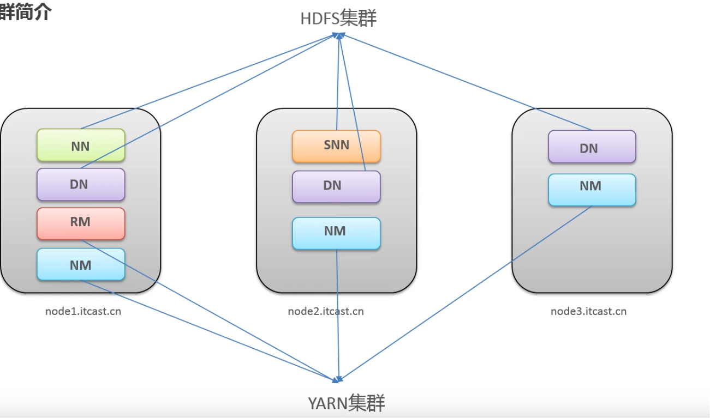

# HADOOP

## 介绍

* hadoop 集群包括两个集群： HDFS集群和 YARN集群。

* 这两个集群逻辑上分离，但是物理上在一起。

  ​	两个集群互相之间没有依赖，互不影响，但是往往部署在同一台服务器上。

* 两个集群都是标准的主从架构集群

HDFS集群(分布式存储) 

* 主角色： NameNode，简称nn
* 从解决： DataNode，简称dn
* 主角色辅助角色： SecondaryNameNode

YARN集群(资源管理、调度)

* 主角色： ResourceManager

* 从角色： NodeManager 

  

## 集群搭建




HDFS集群+YARN集群共同组成一个hadoop集群。

### HADOOP部署模式

* 单机模式（5个角色部署在同一台主机上）
* 伪分布式（一个集群运行多个进程，每个角色一个进程，主要用于调试)
* 集群模式
* HA高可用

### 源码编译

略

### 集群安装

* 1、集群角色规划

  * 根据软件的工作情况以及服务器的硬件资源合理分配。比如依赖内存工作的NameNode是不是部署在大内存的机器上

* 角色规范注意事项

  ​	资源有抢夺冲突的，尽量不要部署在一起。工资尚需要互相配合的尽量部署在一起。


## krb5

### 服务端安装

```shell
dnf install krb5-server krb5-workstation krb5-lib -y 
```

配置：

* /etc/krb5.conf 
* /var/kerberos/krb5kdc/kdc.conf
* /var/kerberos/krb5kdc/kadm5.acl   

初始化数据库

```shell
 kdb5_util create -s -r  XXX
```

启动服务

```shell
systemctl enable --now  krb5kdc kadmin 
```


### 客户端


### 生成eytab并分发

创建如下账户

| 账户 | 说明            |
| ---- | --------------- |
| nm   | namenode        |
| dn   | datanode        |
| rm   | resourcemanager |
| jhs  | job history     |
| HTTP | http            |
| hive | hive            |


创建用户

```shell
 groupadd hadoop ; useradd hdfs -g hadoop -p hdfs ;useradd  hive -g hadoop -p hive ; useradd yarn -g hadoop -p yarn ;useradd http -g hadoop -p http
```

其他主机上都需要执行！！！！

创建一个存放keytab的文件夹

```shell
mkdir /etc/security/keytabs
```


使用keytab免密认证

```shell
kinit -kt  xxx.krytab  用户
```


进入kadmin后台

```shell
kadmin.local
```

创建

```shell
addprinc  -randkey hive/hadoop@TEST.COM
```

生成keytab 

```shell
 ktadd -k /etc/security/keytabs/rm.keytab rm/hadoop@TEST.COM

```


##  HDFS

HDFS(hadoop distribbuted file system),hadoop分布式文件系统，是apache hadoop的核心组件之一。 作为大叔据生态圈最底层的分布式存储服务而存在。

分布式文件系统解决大叔据如何存储的问题。